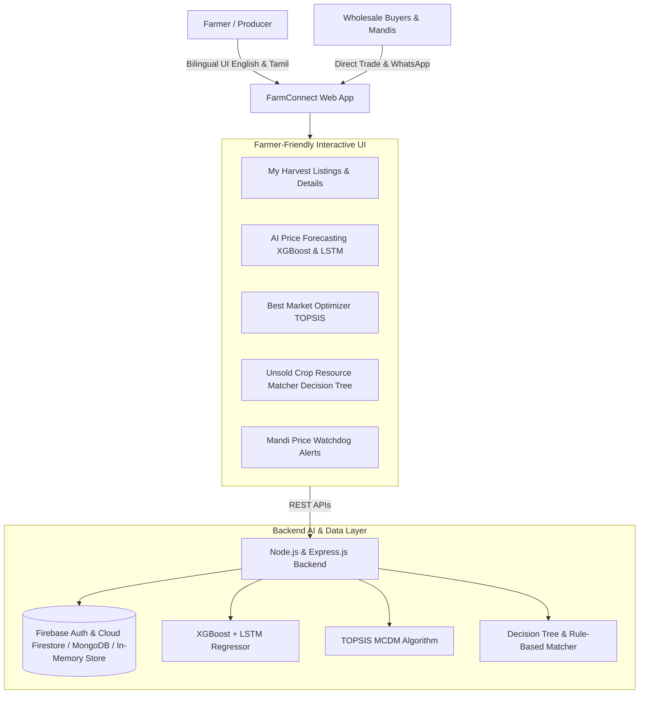

# FarmConnect (ஃபார்ம்கனெக்ட்) 🚜

**FarmConnect** is an AI-powered Direct Farmer-to-Buyer Marketplace designed to eliminate middlemen, maximize farmer income, and minimize post-harvest produce waste.

---

## 🌟 Core System Architecture



---

## 🧠 AI / Machine Learning Capabilities

### 1. Hybrid Price Forecaster (XGBoost & LSTM)
- **Long Short-Term Memory (LSTM)**: Recurrent cell sequence model predicting forward price trajectories (7, 15, and 30 days) using historical 30-day temporal lag momentum and cyclical seasonal harmonics.
- **Extreme Gradient Boosted Trees (XGBoost)**: Evaluates exogenous market features:
  - Daily Mandi Arrival Volumes (supply shock elasticity)
  - Rainfall / Weather Anomaly percentage
  - Diesel & Transportation index
  - Retail and festival demand surge
- **Actionable Advisory**: Gives farmers a clear strategic recommendation: `HOLD`, `SELL NOW`, or `STAGGERED SALE` with confidence scores and Mean Absolute Percentage Error (MAPE).

### 2. Multi-Criteria Decision Making (TOPSIS)
Ranks prospective buyers and mandis based on 4 criteria:
1. **Offered Price** ($\text{₹/qtl}$) — *Benefit criterion (+)*
2. **Demand Score** ($1 - 100$) — *Benefit criterion (+)*
3. **Distance** ($\text{km}$) — *Cost criterion (-)*
4. **Transport Rate** ($\text{₹/km}$) — *Cost criterion (-)*

**Mathematical Steps Executed**:
- Vector normalization: $r_{ij} = \frac{x_{ij}}{\sqrt{\sum_{k=1}^m x_{kj}^2}}$
- Weighted matrix: $v_{ij} = w_j \cdot r_{ij}$
- Ideal positive $A^+$ and Ideal negative $A^-$ solutions
- Euclidean separations $S_i^+, S_i^-$
- Closeness coefficient: $C_i = \frac{S_i^-}{S_i^+ + S_i^-}$
- Net farmer take-home payout after deducting logistics friction.

### 3. Unsold Produce Salvage Matcher (Decision Tree)
Eliminates distress selling and food waste by matching surplus crops to 5 verified circular economy streams:
1. **Food Processing / Agro-Industry** (Pulp, puree, dehydration) — *65% - 80% market recovery*
2. **Animal Feed & Fodder** (Dairy cattle silage, poultry feed) — *40% - 55% recovery*
3. **Donation / Food Banks** (Zero-waste food relief) — *Tax 80G credit + Free transport pickup*
4. **Organic Compost & Vermiculture** (Soil regeneration) — *15% - 25% recovery / bio-fertilizer barter*
5. **Biogas & Clean Bio-Energy (CBG)** (Anaerobic digesters) — *₹2.00 - ₹3.50 / kg incentive*

---

## 🌐 Dual Language Support (English & தமிழ்)
- Instant switcher on top header (🇮🇳 தமிழ் / 🇬🇧 English)
- Translates all crop categories, form fields, TOPSIS metrics, decision paths, and price alerts.

---

## 🛠️ Technology Stack
- **Frontend**: HTML5, Modern CSS Design System (Emerald green palette, glassmorphism, mobile-responsive), Vanilla JavaScript, Chart.js.
- **Backend**: Node.js, Express.js.
- **Database**: MongoDB (Mongoose models) with auto-detecting in-memory persistence fallback.
- **Python ML Pipeline**: Standalone model in [`ml_models/train_predict.py`](file:///c:/Users/Ragavi%20Mathivanan/OneDrive/Desktop%20-%20Copy/Github/AI-workshop/ml_models/train_predict.py).

---

## 🚀 Running the Application
The server is currently running at:
**http://localhost:5000**

To run or restart manually:
```bash
node server/server.js
```

To test the Python ML pipeline:
```bash
python ml_models/train_predict.py
```
